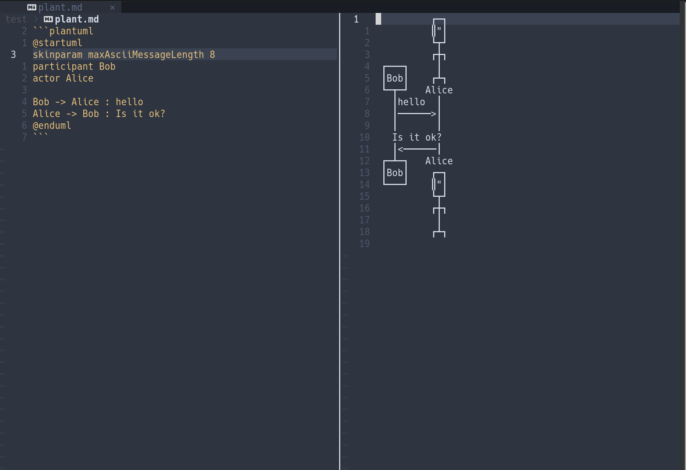

# plantuml-ascii.nvim

## Instllation
### lazy.nvim
```
use{
    'arakkkkk/plantuml-ascii.nvim',
		config = function()
			require("plantuml_ascii").setup({})
		end,
}
```

## Usage

Execute the following in the marodkwn code block describing the plantuml.
```
:PlantUMLAscii
```



## Requires
